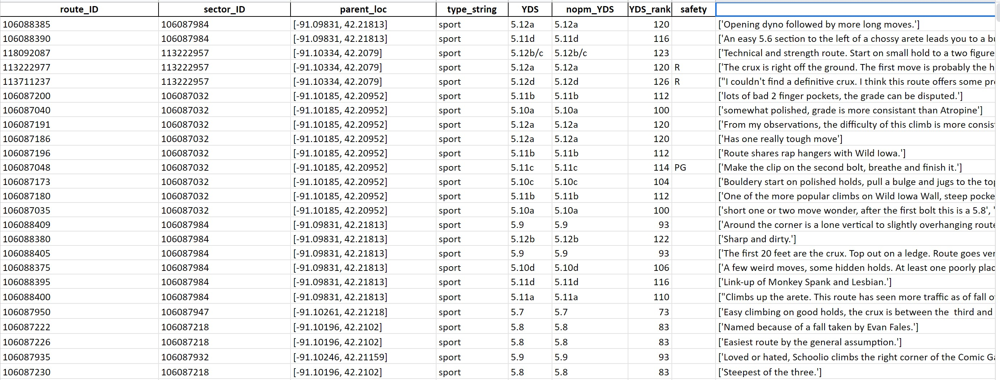

## Choosing the Right Climbing Route for You

Hello! For our group's final capstone project for CS 6730, our group has chosen to explore [OpenBeta's open source rock climbing dataset](https://github.com/OpenBeta/climbing-data). It contains climbing routes data from [MountainProject](https://www.mountainproject.com/) that has been extracted from an immense variety of locations all across the USA.

### Raw Data

### Map View

<iframe seamless frameborder="0" src="https://public.tableau.com/views/map_routes/Dashboard1?:language=en-US&embed=yes&:display_count=yes&:showVizHome=no" width = '850' height = '550' scrolling='yes' ></iframe>    

### Keywords of Interest that We Identified

<iframe seamless frameborder="0" src="https://public.tableau.com/views/keywords_frequency/Dashboard1?:language=en-US&embed=yes&:display_count=yes&:showVizHome=no" width = '550' height = '650' scrolling='yes' ></iframe> 

### Categories of the Data

<iframe seamless frameborder="0" src="https://public.tableau.com/views/climbinganalysis2/Dashboard1?:language=en-US&embed=yes&:display_count=yes&:showVizHome=no" width = '550' height = '550' scrolling='yes' ></iframe> 

### Kewords Common Between Categories

<iframe seamless frameborder="0" src="https://public.tableau.com/views/climbinganalysis2/Dashboard2?:language=en-US&embed=yes&:display_count=yes&:showVizHome=no" width = '850' height = '650' scrolling='yes' ></iframe>    